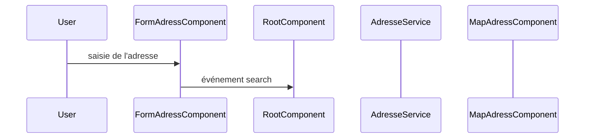

# TP formulaire adresse

Le but de ce TP est de coder un formulaire de recherche d'adresse.
On s'appuiera sur :
* l'API `api-adresse.data.gouv.fr` pour la recherche proprement dite
* La bibliothèque `leaflet` pour l'affichage de marqueurs sur une carte
* La bibliothèque `Angular Material` pour la définition des éléments de formulaire
* Les observables `RxJS` pour orchestrer l'ensemble

On vous fourni un squelette de projet Angular, avec les dépendances nécessaires, ainsi que les composants `FormAdressComponent` qui implémente un champs de recherche d'adresse avec auto-complétion et `MapAdressComponent` qui affiche la carte correspondante.

Le comportement final attendu est celui du lien suivant : https://alexdmr.github.io/l3m-2024-2025-tp-formulaire/

Vous pouvez tester en entrant comme adresse `fontaine`.

## A) Compréhension générale

* Quelles sont les entrées et sorties des composants `FormAdressComponent` et `MapAdressComponent` ?
* Détaillez les types de données de ces entrées et sorties.

### A.1) Recherche

Bien que le squelette de projet ne soit pas complet, on peut déjà déduire du code comment la recherche d'adresse est effectuée et comment les résultats de cette recherche seront affichés. En utilisant `mermaid` ou un autre langage de votre choix, dessinez un diagramme de séquence qui illustre le processus de recherche d'adresse.

Ci dessous un début de définition de ce schéma :



### A.2) Sélection

Faites de même pour la sélection d'une adresse dans la liste des résultats possible.

## B) Complétez le service `AdresseService`

La méthode `search` du service `AdresseService` doit appeler l'API `api-adresse.data.gouv.fr` pour récupérer les adresses correspondant à la recherche de l'utilisateur. Vous vous appuierez sur le service `HttpClient` d'Angular pour effectuer la requête. Notez que ce service est déjà injecté dans le service `AdresseService`.

Le code suivant permet de configurer l'émission d'une requête HTTP GET vers l'API `api-adresse.data.gouv.fr`, notez que cela produit un `Observable<HttpResponse<Object>>` :

```typescript
this._httpClient.get(
    `https://api-adresse.data.gouv.fr/search/`, 
    { observe: 'response', params: { q, limit: 5 } }
)
```

### B.1) Expliquer ce que le code ci-dessus fait. 

Détaillez les données envoyées et le type de réponse attendu.

### B.2) Dérivation d'observable

Vous devez dériver cet observable afin de vérifier que la réponse contient bien un code confirmant le succès de la requête. Soit `r` la réponse, alors :
* Si `r.ok`, il faut vérifier que le corp de la réponse (`r.body`) contient bien un `FeatureCollection<Point, Adress>`. Vous utiliserez pour cela la fonction **`parserFcPtAdresse`** définie au début du fichier `adresse.service.ts`.
* Sinon, il faut lever une erreur à l'aide de la fonction RxJS `throwError`.

**Indication**: Voir l'opérateur `switchMap` de RxJS.

## C) Orchestration dans le composant racine

### C.1) Explications `selectedAdressState`

Expliquez comment est définit l'attribut `selectedAdressState` ? 
Quel est son type ? 
Sa valeur initiale ? 
Comment est-il mis à jour ?

### C.2) Explications `_selectedAdressStateObs`

Expliquez comment est définit l'attribut `_selectedAdressStateObs` ? Que signifie `EMPTY` ?

### C.3) Code

Définissez l'observable `_selectedAdressStateObs`, 
dérivez le à partir du sujet `_searchQuery`.

**Indication**: Vous aurez besoin de `switchMap`, `map` et `catchError` de RxJS.
### C.4) Mises à jour

Prenez aussi en compte les mises à jours (observable `updates`) pour mettre à jour les valeurs produites par `_selectedAdressStateObs`.

**Indication**: Vous aurez besoin de `scan` et de `startWith` de RxJS.